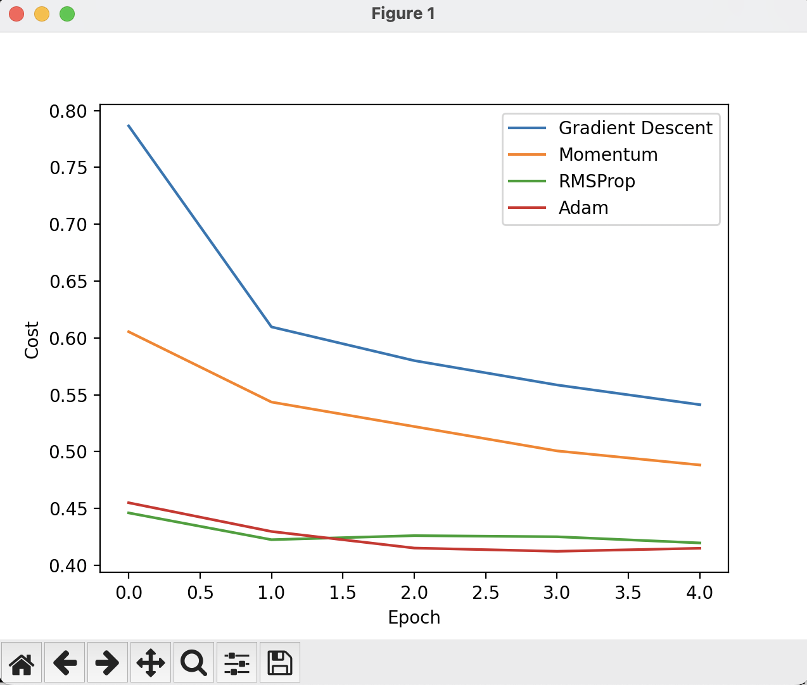
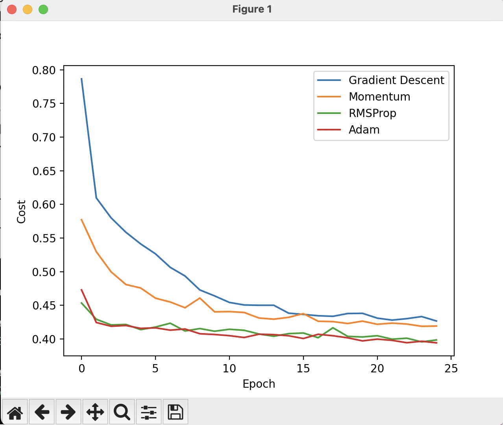

# TelCoChurnNumpyOptimizationSuite

## Deep Learning Optimization Benchmark Suite
Construction of a multi-layer neural network from scratch using NumPy to predict customer churn/cancellation. In this project, I specifically compare convergence speed (lowering the cost) and performance of four optimizer engines (Gradient Descent, Momentum, RMSProp and Adam).

## Neural Network Architecture
**Layer Dimensions:** [Input (45), Hidden1 (20), Hidden2 (7), Output (1)] 
**Hidden Activations:** ReLU  
**Output Activations:** Sigmoid  
**Weight Initialization:** He Initialization 

## Optimization Algorithms Compared:
### Test Results
**For 5 epochs:**
Gradient Descent Accuracy: 72.75% 
Momentum Accuracy: 74.59% 
RMSProp Accuracy: 78.35% 
Adam Accuracy: 80.27% 

**For 25 epochs:**
Gradient Descent Accuracy: 79.13% 
Momentum Accuracy: 79.21% 
RMSProp Accuracy: 78.07% 
Adam Accuracy: 80.06% 

### Technical Breakdowns
**Gradient Descent**: This is our baseline optimizer. When applied to mini batches, the cost trends downward. However it remains noisy since some mini-batches are naturally easier while others are harder. The parameters are updated using only the current batch's raw gradients iwith no historical memory tracking.

**Momentum**: uses the average gradient to minimize the oscillation of gradients between positive and negative values. In other words, this brings the average gradients closer to 0.

**RMSProp**: dampens the oscillations in the directions where gradients are large (which is usually on the vertical axis) by dynamically scaling the gradients during training. It allows for use of a larger learning rate without overshooting. 

**Adam**: this obtains the smoothing/speed of momentum while also utilizing the stability/scaling of RMSprop. It works well with noisy gradients or sparse data.

## Key Engineering Challenges Overcome
**Challenge 1**: To handle the large values such as TotalCharges that could very well skew a mini batch (if a mini batch happened to have an abnormal amount of large values), I normalized the data to avoid abnormal mini-batch skewing. I did the same with tenure and MonthlyCharges. 

**Challenge 2**: To properly train and test the neural network, I had to split the data into 80% training data and 20% test data. 

**Challenge 3**: When I implemented the mini-batches, I realized it completely changed how the matrix slicing had to work compared to my first churn network. I had to figure out how to loop through the data in small, randomized blocks of 64 instead of just feeding the entire dataset in at one time. 

## Visual Performance Analysis
I found that when the epochs are 5, the Adam and RMSProp curves demonstrated the fastest convergence speeds while Gradient Descent had the slowest convergence speed and maintained the highest cost. I found a similar situation when the epochs is 25 - however, RMSProp and Adam seemed to oscillate (or have the similar convergence speed) towards the end of the 25 epochs.

### 5-Epoch Optimization Race

### 25-Epoch Optimization Convergence

## Final Test Accuracy Scorecard
All in all, I found that the accuracy of Adam surpassed that of the other models for the number of epochs I used. I did find that if I increased the # of epochs to 100, the RMSProp accuracy came out slightly better than the Adam accuracy (80.06% vs. 79.56%).
